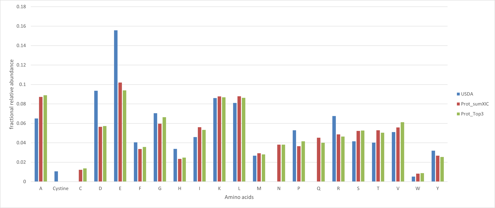

# ACE: A fast quantitative approach of amino acid composition estimation
Calculating amino acid composition of a food sample usually requires expensive instruments and long processing time in laboratories. We propose a fast quantitative approach to approximate the amino acid composition of food samples given their proteomics data. We utilize Top3 quantitation method and a sophisticated data preprocessing pipeline to achieve a relatively accurate estimation.

**Fig 1. Amino acid composition estimation of broiled groun beef patty food sample.** Blue is the ground truth provided by USDA. Red is a baseline approach without using Top3 quantitation. Green is our proposed approach with Top3 quantitation and sophiscated data preprocessing.
## Directories
* <code>[Example](./ace/example)</code>: Example notebooks.
* <code>[CLI](./ace/main.py)</code>: Command-line interface script.

# Getting Started
## Installation
```
git clone https://github.com/IBPA/ACE.git
pip install ./ACE
```

## Prerequisites
```
python>=3.6
numpy>=1.19.3
pandas>=1.1.5
notebook>=6.1.5
```

## How to Use
### Command-line Interface
#### Usage
```
cd path/to/ACE/ace
python main.py -h
usage: main.py [-h] [--output [OUTPUT]] [--save-pqi]
               [--log-level {10,20,30,40,50}] [input]

positional arguments:
  input                 The path to your proteomics data file.

optional arguments:
  -h, --help            show this help message and exit
  --output [OUTPUT], -o [OUTPUT]
                        The path to store your output.
  --save-pqi, -s
  --log-level {10,20,30,40,50}, -l {10,20,30,40,50}
                        The specified log level:
                        - 50: CRITICAL
                        - 40: ERROR
                        - 30: WARNING
                        - 20: INFO
                        - 10: DEBUG
```

#### Example
```
python main.py ../example/proteomics_example.csv -o example --save-pqi
```

### API
#### Example
- [Estimate amino acid composition](./example/estimate_amino_acid_composition.ipynb)
- [Customize your hash table](./example/create_custom_hash_table.ipynb)

## Authors
* **Fangzhou Li** - https://github.com/fangzhouli

## Contact
For any questions, please contact us at tagkopouloslab@ucdavis.edu.

## License
This project is licensed under the Apache 2.0 License. Please see the <code>[LICENSE](./LICENSE)</code> file for details.

## Credits
Thanks Nikita Bacalzo for providing data. Thanks Jason Youn for code review. Thanks Prof. Tagkopoulos and Prof. Lebrilla for advising and support.

## References
- [1] [Gerster, Sarah, et al., 2014. Statistical Approach to Protein Quantification.](https://www.ncbi.nlm.nih.gov/pmc/articles/PMC3916661/)
